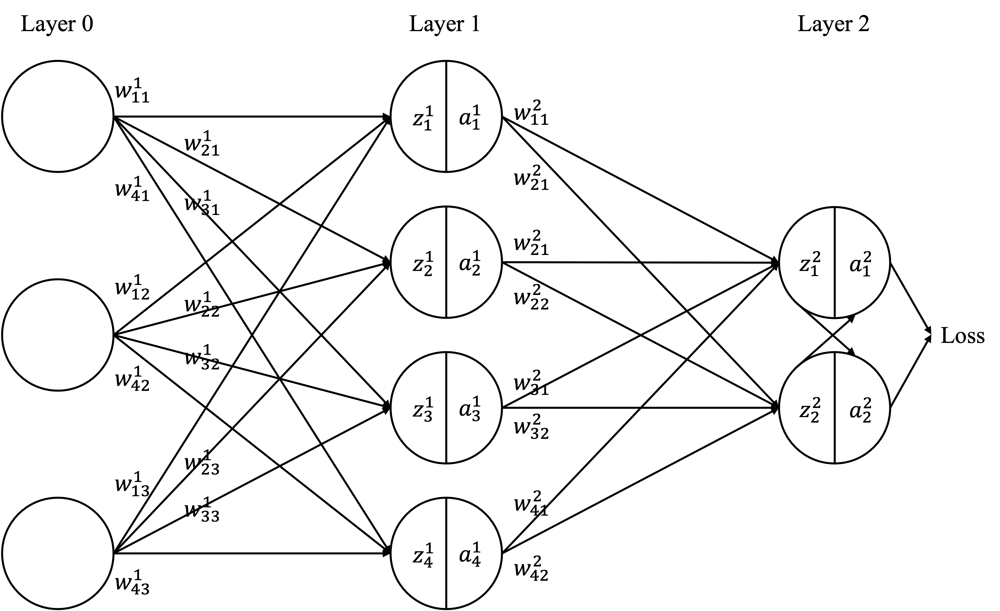
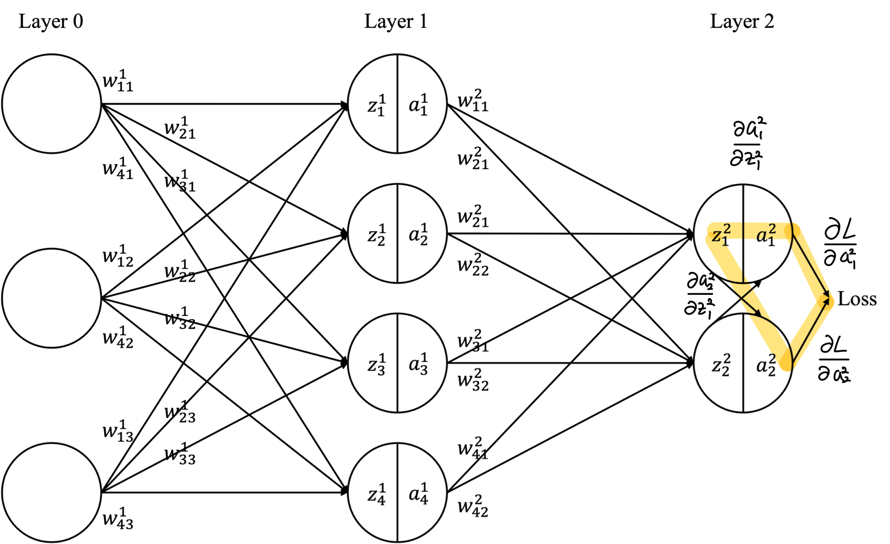
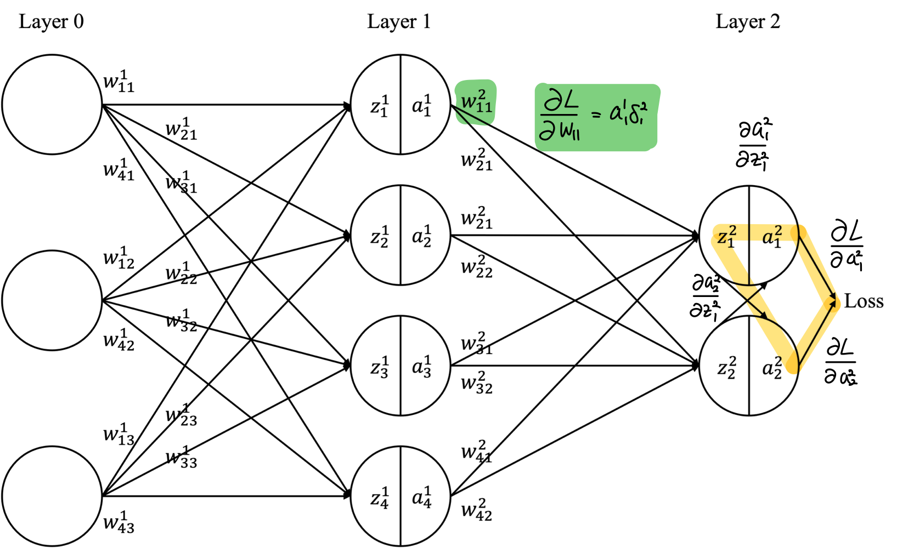
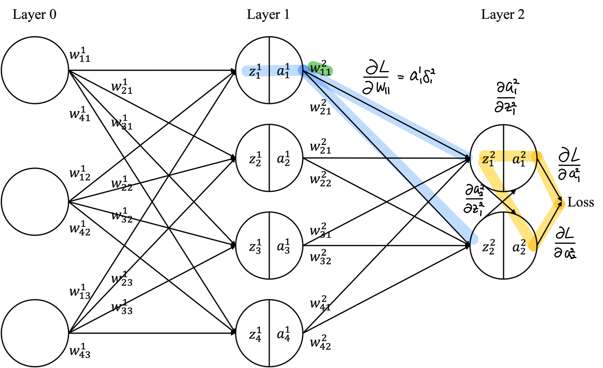
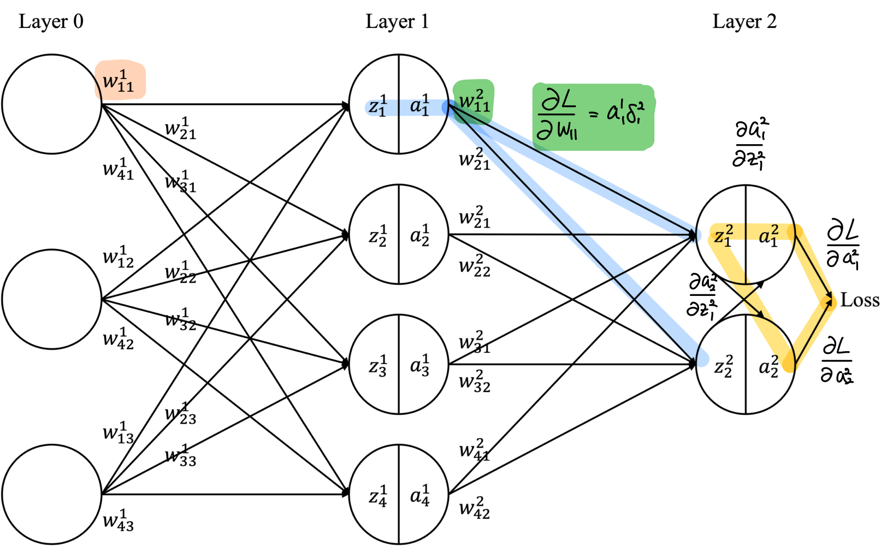

# 1. Neural Network Overview

This lecture covers the fundamental mechanics of forward and backward propagation in Neural Networks (NN). The network structure and notation used in this lecture are defined as follows:

<p align="center"> </p>

+ $w^l_{jk}$ is the weight from the $k^{th}$ neuron in the $(l-1)^{th}$ layer to $j^{th}$ neuron in the $l^{th}$ layer. 
+ $b^l_j$ is the basis of the $j^{th}$ neuron in the $l^{th}$ layer.
+ $a^l_j$ is the activation of the $j^{th}$ neuron in the $l^{th}$ layer, where $a^l_j = \sigma \left(z^l_j \right)$
+ $\sigma$ represents the activation function. In this lecture, we use the sigmoid function, except for the last layer where we use softmax. $\sigma(z) = \frac{1}{1 + e^{-z}}$
+ $z^l_j$ is defined by: $z^l_j =\sum_k w^l_{jk} a^{l-1}_k +b^l_j$

The $w^l_{jk}$ notation might initially seem counterintuitive. However, using $j$ for input neurons and $k$ for output neurons would necessitate writing the weight matrix in a transposed form. Also, inking $z^2_1$ and $a^2_2$ in Layer 2 may appear awkward. Yet, this is natural given the Softmax function in the last layer. (Remember how Softmax values are computed.)

# 2. Forward Propagation
This section demonstrates how forward propagation works using example values.

## 2.1. Example
**Input**

$a^0 = (a^0_1, a^0_2, a^0_3) = (1.0, 0.5, -1.0)$

**Layer 1**

$$
W^1 = 
\begin{bmatrix}
0.2 & -0.3 & 0.5 \\ 
0.7 & 0.1 & -0.2 \\ 
-0.5 & 0.4 & 0.3 \\ 
0.1 & -0.4 & 0.2
\end{bmatrix},
\quad b^1 = 
\begin{bmatrix} 
0.1 \\ 
-0.2 \\ 
0.05 \\ 
0.0 
\end{bmatrix}
$$

Expressed in notation:
+ $w^1_{11}=0.2, w^1_{12}=-0.3, w^1_{13}=0.5$
+ $w^1_{21}=0.7, w^1_{22}=0.1, w^1_{23}=-0.2$
+ $w^1_{31}=-0.5, w^1_{32}=0.4, w^1_{33}=0.3$
+ $w^1_{41}=0.1, w^1_{42}=-0.4, w^1_{43}=0.2$
+ $b^1_1=0.1, b^1_2=-0.2, b^1_3=0.05, b^1_4=0$

**Layer2**

$$
W^2 = 
\begin{bmatrix} 
0.3 & -0.6 & 0.2 & 0.1 \\ 
-0.2 & 0.1 & 0.4 & -0.5 
\end{bmatrix}, 
\quad b^2 = 
\begin{bmatrix} 
0.05 \\ 
-0.1 
\end{bmatrix}
$$

Expressed in notation:
+ $w^2_{11}=0.3, w^2_{12}=-0.6, w^2_{13}=0.2, w^2_{14}=0.1$ 
+ $w^2_{21}=-0.2, w^2_{22}=0.1, w^2_{23}=0.4, w^2_{24}=-0.5$
+ $b^2_1=0.05, b^2_2=-0.1$

Total number of weight: $3\times 4 + 4\times 2 = 20$

Total number of bias: $4+2=6$

## 2.2. Feedforward

### 2.2.1. Layer 1 (Hidden layer)

**Neuron 1 $j = 1$**

$$
\begin{align}
z^1_1 = \sum_{k=1}^3 w^1_{1k} a^0_k + b^1_1 &= 0.2\cdot 1.0 + (-0.3)\cdot 0.5 + 0.5\cdot(-1.0) + 0.1\\ 
&= 0.2 - 0.15 - 0.5 + 0.1\\ 
&= -0.35
\end{align}
$$

activation: 

$$
a^1_1 = \sigma(z^1_1) = \sigma(-0.35) \approx 0.4134
$$

**Neuron 2 $j = 2$**

$$
\begin{align}
z^1_2 &= 0.7\cdot 1.0 + 0.1\cdot 0.5 + (-0.2)\cdot(-1.0) + (-0.2)\\
&= 0.7 + 0.05 + 0.2 - 0.2 \\
&= 0.75
\end{align}
$$

activation:

$$
a^1_2 = \sigma(0.75) \approx 0.6792
$$

**Neuron 3 $j = 3$**

$$
\begin{align}z^1_3 &= (-0.5)\cdot 1.0 + 0.4\cdot 0.5 + 0.3\cdot(-1.0) + 0.05\\ 
&= -0.5 + 0.2 - 0.3 + 0.05\\ 
&= -0.55 \approx -0.55
\end{align}
$$

activation:

$$
a^1_3 = \sigma(-0.55) \approx 0.3659
$$

**Neuron 4 $j = 4$**

$$
\begin{align}z^1_4 &= 0.1\cdot 1.0 + (-0.4)\cdot 0.5 + 0.2\cdot(-1.0) + 0.0\\
&= 0.1 - 0.2 - 0.2\\ 
&= -0.3
\end{align}
$$

activation:

$$
a^1_4 = \sigma(-0.3) \approx 0.4256
$$

Layer 1 Summary

$$
z^1 \approx (-0.35, 0.75, -0.55, -0.30)
$$

$$
a^1 \approx (0.4134, 0.6792, 0.3659, 0.4256)
$$

### 2.2.2. Layer 2 (Output layer)

Here, we first calculate the **logit** $z^2_j$, then apply softmax.

Output Neuron 1 $j = 1$

$$
\begin{align}
z^2_1 &= 0.3\cdot a^1_1 + (-0.6)\cdot a^1_2 + 0.2\cdot a^1_3 + 0.1\cdot a^1_4 + 0.05\\
&\approx 0.3 \cdot 0.4134+(-0.6) \cdot 0.6792+0.2 \cdot 0.3659+0.1 \cdot 0.4256 + 0.05\\
&\approx 0.1240 - 0.4075 + 0.0732 + 0.0426 + 0.05\\ 
&\approx -0.1178
\end{align}
$$

Output Neuron 2 $j = 2$

$$
\begin{align}
z^2_2 &= (-0.2)\cdot a^1_1 + 0.1\cdot a^1_2 + 0.4\cdot a^1_3 + (-0.5)\cdot a^1_4 - 0.1\\
&\approx (-0.2) \cdot 0.4134+0.1 \cdot 0.6792+0.4 \cdot 0.3659+(-0.5) \cdot 0.4256-0.1\\
&\approx -0.0827 + 0.0679 + 0.1464 - 0.2128 - 0.1\\ 
&\approx -0.1812
\end{align}
$$

Applying Softmax

$$
\text{softmax}(z)_j = \frac{e^{z_j}}{\sum_i e^{z_i}}
$$

Since there are two neurons:

$$
a^2_1 = \frac{e^{z^2_1}}{e^{z^2_1} + e^{z^2_2}},\quad a^2_2 = \frac{e^{z^2_2}}{e^{z^2_1} + e^{z^2_2}}
$$

* $z^2_1 \approx -0.1178 \Rightarrow e^{z^2_1} \approx 0.889$
* $z^2_2 \approx -0.1812 \Rightarrow e^{z^2_2} \approx 0.834$

Sum: $e^{z^2_1} + e^{z^2_2} \approx 0.889 + 0.834 = 1.723$

Therefore:

$$
a^2_1 \approx \frac{0.889}{1.723} \approx 0.5159,\quad a^2_2 \approx \frac{0.834}{1.723} \approx 0.4841
$$

The sum of the softmax results is 1:

$$
a^2_1 + a^2_2 \approx 1.000
$$

### 2.2.3. Calculate Loss

Assuming a target vector of

$$
y = (1, 0)
$$

and calculating the MSE (Mean Squared Error) for the output $a^2 = (a^2_1, a^2_2)$:

$$
L = \frac{1}{2}\sum_{j=1}^2 (a^2_j - y_j)^2
$$

* $a^2_1 \approx 0.5159, y_1 = 1$
* $a^2_2 \approx 0.4841, y_2 = 0$

$$
\begin{align}
L &= \frac{1}{2} \left[ (0.5159 - 1)^2 + (0.4841 - 0)^2 \right]\\
& = \frac{1}{2} \left[ (-0.4841)^2 + (0.4841)^2 \right]\\
& = \frac{1}{2} \left[ 2 \cdot (0.4841)^2 \right] \\
& = (0.4841)^2\\
&\approx 0.2344
\end{align}
$$

# 3. Backpropagation

## 3.1. The two assumptions about the loss function

The goal of backpropagation is to compute the partial derivatives $\partial L / \partial w$ and $\partial L / \partial b$ of the loss function $L$ with respect to any weight $w$ or bias $b$ in the network. For backpropagation to work properly, we make two main assumptions about the form of the loss function. Before stating them, it is useful to have a specific loss function in mind. We will use the quadratic loss.

**Assumption 1: The loss function can be written as an average over loss functions for individual training examples.**
The loss function $L$ can be written as an average of individual loss $L_x$:

$$
L = \frac{1}{n} \sum_x L_x.
$$

This clearly holds for the quadratic loss, where the loss for a single example is $L_x = \frac{1}{2}\|y - a^{output}\|^2$. Why is this assumption necessary? Backpropagation actually computes $\frac{\partial L_x}{\partial w}, \frac{\partial L_x}{\partial b}$ for a single training example. The partial derivatives for the total loss $\frac{\partial L}{\partial w}, \frac{\partial L}{\partial b}$ are obtained by averaging over the training examples. Thus, this assumption is also required to use approaches like SGD.

**Assumption 2: The loss function can be written as a function of the outputs from the neural network.**
The loss function can be expressed as a function of the network's output values: $L = L(a^{output})$. Since backpropagation starts from the final Loss, it cannot be applied if intermediate layer values are used as the loss.

## 3.2. Output Layer Backpropagation

### 3.2.1. Error Signal $\delta^2_j = \dfrac{\partial L}{\partial z^2_j}$

<p align="center"> </p>

Recall that our goal is to update $w$ and $b$ to reduce $L$. Since $z$ is a linear combination of $w$ and $b$, we must calculate the change in $L$ with respect to $z$. Therefore, according to the chain rule, the change in $L$ with respect to the change in $z^2_j$ is expressed as follows (refer to the proof of the multivariable chain rule):

$$
\frac{\partial L}{\partial z^2_j}= \sum_{m=1}^2\frac{\partial L}{\partial a^2_m}\frac{\partial a^2_m}{\partial z^2_j}
$$

Also, $\partial L/\partial z^2_j$ is called the error signal and is defined as:

$$
\delta^2_j := \frac{\partial L}{\partial z^2_j}
$$

For example, if $j=1$, this calculates the gradient value corresponding to the yellow highlight in the diagram.

> **Proof of the Multivariable Chain Rule (optional)**

**Assumption**:

$w = w(x, y)$ : Function of two variables $x,y$

$x = x(z), y = y(z)$ : Both are functions of $z$

$\therefore w(z) = w(x(z), y(z))$

```
      w
     / \
    x   y
    |   |
    z   z
```

**Claim**:

$$
\frac{dw}{dz} =\frac{\partial w}{\partial x}\frac{dx}{dz}+\frac{\partial w}{\partial y}\frac{dy}{dz}
$$

**Proof**

$$
\begin{align}
\frac{dw}{dz}&= \lim_{\Delta z \to 0}\frac{w\big(x(z+\Delta z),\, y(z+\Delta z)\big)-w\big(x(z),\, y(z)\big)}{\Delta z}\\
&=\lim_{\Delta z \to 0}\left[\frac{w\big(x(z+\Delta z),\, y(z+\Delta z)\big)- w\big(x(z),\, y(z+\Delta z)\big)}{\Delta z}+
\frac{w\big(x(z),\, y(z+\Delta z)\big)- w\big(x(z),\, y(z)\big)}{\Delta z}\right]\\
&=\lim_{\Delta z \to 0}\left[\frac{w\big(x(z+\Delta z),\, y(z+\Delta z)\big)- w\big(x(z),\, y(z+\Delta z)\big)}{x(z+\Delta z) - x(z)}\cdot\frac{x(z+\Delta z) - x(z)}{\Delta z}\right]\\
&\qquad + \left[\frac{w\big(x(z),\, y(z+\Delta z)\big)- w\big(x(z),\, y(z)\big)}{y(z+\Delta z) - y(z)}\cdot\frac{y(z+\Delta z) - y(z)}{\Delta z}\right]\\
&=\frac{\partial w}{\partial x}\frac{dx}{dz}+\frac{\partial w}{\partial y}\frac{dy}{dz}
\end{align}
$$

### 3.2.2. Derivative of Loss Function $\dfrac{\partial L}{\partial a^2_j}$

To calculate the error signal $\delta^2_j$, we first need to calculate $\partial L/\partial a^2_j$. We previously calculated loss using MSE. Therefore, to know the change in loss with respect to the activation value, we must differentiate the MSE. The derivative of MSE is:

$$
\begin{align}
\frac{\partial L}{\partial a^2_j}&= \frac{\partial}{\partial a^2_j} 
\left( \frac{1}{2} \sum_{j=1}^2 (a^2_j - y_j)^2 \right)\\
&= (a^2_j - y_j)
\end{align}
$$

**Substituting example values**:

$j=1$, $y_1 = 1$

$$
\frac{\partial L}{\partial a^2_1} = a^2_1 - 1 \approx 0.515852 - 1 = -0.484148
$$

$j=2$, $y_2 = 0$

$$
\frac{\partial L}{\partial a^2_2} = a^2_2 - 0 \approx 0.484148
$$

Summary

$$
\frac{\partial L}{\partial a^2} \approx (-0.484148, 0.484148)
$$

> **Proof of Scalar Function Chain Rule Application (optional)**

Previously, in the forward propagation phase, we summed the outputs of each neuron to obtain a single loss. A question might arise: the loss is composed of two scalar functions; can the multivariable chain rule be applied identically? The answer is yes. Here is the proof.

**Assumption**

1.  Let the output layer activation values be $\mathbf{a}^2 = (a^2_1, a^2_2)^\top$ and the target vector be $\mathbf{y} = (y_1, y_2)^\top$.

2.  Define the **partial loss** for each output neuron as $L_m(\mathbf{a}^2) = \frac{1}{2}(a^2_m - y_m)^2,\quad m=1,2$, and the total loss as $L(\mathbf{a}^2) = \sum_{m=1}^2 L_m(\mathbf{a}^2)$.

3.  Assume each $L_m$ depends only on its corresponding output $a^2_m$:

$$
\frac{\partial L_j}{\partial a^2_m} = 0 \quad (j \neq m)
$$

**Claim**

$$
\displaystyle \frac{\partial L}{\partial a^2_m} = \frac{\partial L_m}{\partial a^2_m}\quad (m=1,2)  
$$

Also, applying the multivariable chain rule for any intermediate variable $x$:

$$
\frac{\partial L}{\partial x}  
= \sum_{m=1}^2 \frac{\partial L}{\partial a^2_m}\frac{\partial a^2_m}{\partial x}  
= \sum_{m=1}^2 \frac{\partial L_m}{\partial a^2_m}\frac{\partial a^2_m}{\partial x}  
$$

This shows that the chain rule applies identically to each component for $L=(L_1,L_2)$.

**Proof**

$$
\begin{align}
L(\mathbf{a}^2) &= \sum_{j=1}^2 L_j(\mathbf{a}^2)\\
\frac{\partial L}{\partial a^2_m} &= \frac{\partial}{\partial a^2_m}\left(\sum_{j=1}^2 L_j(\mathbf{a}^2)\right)\\
\frac{\partial L}{\partial a^2_m} &= \sum_{j=1}^2 \frac{\partial L_j}{\partial a^2_m}\\
\frac{\partial L}{\partial a^2_m} &= \frac{\partial L_m}{\partial a^2_m} + \sum_{\substack{j=1\ j\neq m}}^2 \frac{\partial L_j}{\partial a^2_m}\\
\frac{\partial L_j}{\partial a^2_m} &= 0 \quad (j\neq m)\\
\frac{\partial L}{\partial a^2_m} &= \frac{\partial L_m}{\partial a^2_m}  
\end{align}
$$

### 3.2.3. Derivate of Softmax Function $\dfrac{\partial a^2_m}{\partial z^2_j}$

Next, we calculate the value of $\partial a^2_m/\partial z^2_j$ required for the error signal calculation. Recall that Softmax depends on two inputs $z^2_1, z^2_2$. Given the softmax definition:

$$
a^2_m = \frac{e^{z^2_m}}{\sum_i e^{z^2_i}},
$$

**Partial derivatives for Neuron $1, 2$ are**:

$m=j:$

$$
\frac{\partial a^2_m}{\partial z^2_j}= a^2_m(1 - a^2_j)
$$

$m \neq j:$

$$
\frac{\partial a^2_m}{\partial z^2_j}= -a^2_m a^2_j
$$

Expressing this by substituting indices:

$$
\begin{align}
& \dfrac{\partial a^2_1}{\partial z^2_1} = a^2_1(1-a^2_1)\\
& \dfrac{\partial a^2_2}{\partial z^2_1} = -a^2_2 a^2_1\\
& \dfrac{\partial a^2_1}{\partial z^2_2} = -a^2_1 a^2_2\\
& \dfrac{\partial a^2_2}{\partial z^2_2} = a^2_2 (1-a^2_2)
\end{align}
$$

**Substituting example values**:

$$
\begin{align}
& \dfrac{\partial a^2_1}{\partial z^2_1}\approx 0.515852(1-0.515852)\approx 0.249749\\
& \dfrac{\partial a^2_2}{\partial z^2_1}\approx -0.484148 \cdot 0.515852 \approx -0.249749\\
& \dfrac{\partial a^2_1}{\partial z^2_2} \approx -0.515852\cdot 0.484148 \approx -0.249749\\
& \dfrac{\partial a^2_2}{\partial z^2_2}\approx 0.484148(1-0.484148) \approx 0.249749\\
\end{align}
$$

**Returning to calculate the error signal $\frac{\partial L}{\partial z^2_j}= \sum_{m=1}^2\frac{\partial L}{\partial a^2_m}\frac{\partial a^2_m}{\partial z^2_j}$**:

When $j = 1$:

$$
\begin{align}
\delta^2_1 &= \frac{\partial L}{\partial a^2_1}\frac{\partial a^2_1}{\partial z^2_1} + \frac{\partial L}{\partial a^2_2}\frac{\partial a^2_2}{\partial z^2_1}\\
& \approx (-0.484148)\cdot 0.249749+(0.484148)\cdot(-0.249749)\approx -0.241831  
\end{align}
$$

When $j = 2$:

$$
\begin{align}
\delta^2_2 &= \frac{\partial L}{\partial a^2_1}\frac{\partial a^2_1}{\partial z^2_2}+\frac{\partial L}{\partial a^2_2}\frac{\partial a^2_2}{\partial z^2_2}\\
& \approx (-0.484148)\cdot(-0.249749)+(0.484148)\cdot 0.249749\approx 0.241831  
\end{align}
$$

Summary:

$$
\delta^2 \approx (\delta^2_1, \delta^2_2) = (-0.241831, 0.241831)
$$

This is the gradient (error signal) for the output layer logit $z^2_j$.

> **Proof of Softmax Derivative (optional)**

**Assumption**

Let the output layer logits be $\mathbf{z}^2 = (z^2_1,\dots,z^2_K)$ and define the softmax output as:

$$
a^2_m = \frac{e^{z^2_m}}{\sum_{i=1}^K e^{z^2_i}},\quad m=1,\dots,K  
$$

For convenience, let $S = \sum_{i=1}^K e^{z^2_i}$, then:

$$
a^2_m = \frac{e^{z^2_m}}{S}
$$

The Kronecker delta is:

$$
\delta_{mj} = 
\begin{cases} 1 & (m=j)\\
0 & (m\neq j)  
\end{cases}  
$$

**Claim**

For all $m,j$:

$$
\displaystyle  
\frac{\partial a^2_m}{\partial z^2_j}  
= a^2_m\bigl(\delta_{mj} - a^2_j\bigr)   
$$

**Proof**
First, calculating the partial derivative with respect to $S$:

$$
\begin{align}
& S = \sum_{i=1}^K e^{z^2_i}\\
& \frac{\partial S}{\partial z^2_j} = e^{z^2_j}
\end{align}
$$

Now, since $a^2_m = \frac{e^{z^2_m}}{S}$, let the numerator be $u_m = e^{z^2_m}$ and the denominator be $v = S$, and apply the Quotient rule:

$$
\frac{\partial a^2_m}{\partial z^2_j} = \frac{\partial}{\partial z^2_j}\left(\frac{u_m}{v}\right) = \frac{u_m' v - u_m v'}{v^2}
$$

Here:

$$
u_m' = \frac{\partial e^{z^2_m}}{\partial z^2_j} = \delta_{mj} e^{z^2_m}, \qquad v' = \frac{\partial S}{\partial z^2_j} = e^{z^2_j}
$$

Therefore:

$$
\frac{\partial a^2_m}{\partial z^2_j} = \frac{\delta_{mj} e^{z^2_m}, S - e^{z^2_m}, e^{z^2_j}}{S^2}  
$$

Grouping common factors:

$$
\frac{\partial a^2_m}{\partial z^2_j} = \frac{e^{z^2_m}}{S^2} \Bigl(\delta_{mj} S - e^{z^2_j}\Bigr)  
$$

Rewriting in terms of softmax output:

$$
\frac{e^{z^2_m}}{S} = a^2_m, \quad \frac{e^{z^2_j}}{S} = a^2_j
$$

Thus:

$$
\frac{\partial a^2_m}{\partial z^2_j} = a^2_m\left(\delta_{mj} - \frac{e^{z^2_j}}{S}\right) = a^2_m(\delta_{mj} - a^2_j)
$$

Thus, the Claim holds.

**Lemma**

For a function $f(x) = \dfrac{u(x)}{v(x)}$, if $v(x)\neq 0$:

$$
\frac{df}{dx} = \frac{u'(x)v(x) - u(x)v'(x)}{[v(x)]^2}  
$$

In other words, for a fractional function, it is "(numerator derivative × denominator − numerator × denominator derivative) divided by the denominator squared."
In the proof above, we set

$$
u_m(z^2) = e^{z^2_m},\quad v(z^2) = S = \sum_i e^{z^2_i}  
$$ 

and applied this formula directly.

**Corollary (Reason for splitting m = j and m ≠ j)**

Substituting the definition of the Kronecker delta into the general formula obtained in the Claim:

$$
\frac{\partial a^2_m}{\partial z^2_j} = a^2_m(\delta_{mj} - a^2_j)  
$$

If $m = j$, since $\delta_{mj} = 1$:

$$
\frac{\partial a^2_m}{\partial z^2_m} = a^2_m(1 - a^2_m)  
$$

If $m \neq j$, since $\delta_{mj} = 0$:

$$
\frac{\partial a^2_m}{\partial z^2_j} = - a^2_m a^2_j  
$$

In Softmax, increasing itself (logit $z_m$) directly increases the corresponding probability $a_m$, so the $m=j$ term appears separately. Increasing another value (logit $z_j, j\neq m$) increases the total denominator, causing $a_m$ to decrease relatively, so the $m\neq j$ term is separated.

### 3.2.4. Gradients of Output Layer Weights & Biases

<p align="center"> </p>

This section calculates the gradient for the weights, highlighted in green in the diagram. Biases are not shown in the diagram. Let's update ${\partial L}/{\partial w^2_{jk}}$ and ${\partial L}/{\partial b^2_{j}}$. To do this, recall $z^2_j$:

$$
z^2_j = \sum_{k=1}^4 w^2_{jk} a^1_k + b^2_j
$$

Index reminder:
  + $w^2_{jk}$: Layer 1 $k$-th neuron → Layer 2 $j$-th neuron
  + $a^1_k$: layer 1 activation
  + $b^2_j$: layer 2 bias

**Gradient for weight $w^2_{jk}$**

$$
\frac{\partial z^2_j}{\partial w^2_{jk}} = a^1_k  
$$

Chain Rule:

$$
\frac{\partial L}{\partial w^2_{jk}}  
= \frac{\partial L}{\partial z^2_j}  
\frac{\partial z^2_j}{\partial w^2_{jk}}  
= \delta^2_j \cdot a^1_k  
$$

Recall that we defined $\delta^2_j=\partial L/\partial z^2_j$ previously. Also, recall that unlike $z$ or $z$, $w$ and $b$ are affected by a single $\delta$. Therefore, the single-variable chain rule applies, not the multivariable chain rule. Observe closely how the edges are connected in the diagram.

Next, looking at the example value substitution (row $= j$, column $= k$):

$$
\nabla_{W^2} = 
\begin{bmatrix}
\frac{\partial L}{\partial w^2_{11}} & \frac{\partial L}{\partial w^2_{12}} & \frac{\partial L}{\partial w^2_{13}} & \frac{\partial L}{\partial w^2_{14}} \\
\frac{\partial L}{\partial w^2_{21}} & \frac{\partial L}{\partial w^2_{22}} & \frac{\partial L}{\partial w^2_{23}} & \frac{\partial L}{\partial w^2_{24}}
\end{bmatrix}  
\approx 
\begin{bmatrix}
-0.099969 & -0.164246 & -0.088477 & -0.102913 \\
0.099969 & 0.164246 & 0.088477 & 0.102913  
\end{bmatrix}
$$

Looking at just one in detail:

$$
\frac{\partial L}{\partial w^2_{11}}  
= a^1_1 \delta^2_1  
\approx 0.413382 \cdot (-0.241831)  
\approx -0.099969  
$$

**Gradient for bias $b^2_j$**

$$
\frac{\partial z^2_j}{\partial b^2_j} = 1  
$$

Chain Rule:

$$
\frac{\partial L}{\partial b^2_j}  
= \frac{\partial L}{\partial z^2_j}  
\cdot \frac{\partial z^2_j}{\partial b^2_j}  
= \delta^2_j  
$$

Example values:

$$
\nabla_{b^2} =  
\left(  
\frac{\partial L}{\partial b^2_1},  
\frac{\partial L}{\partial b^2_2}  
\right)  
\approx  
(-0.241831, 0.241831)  
$$

## 3.3. Hidden Layer Backpropagation

### 3.3.1. Backpropagating Error to Hidden Layer $\delta^1_j = \dfrac{\partial L}{\partial z^1_j}$

<p align="center"> </p>

We now perform backpropagation at layer 1. We compute the gradients corresponding to the blue highlights in the figure. To define the error term for layer 1, we first express $\partial L/\partial z^1_j$ using the multivariate chain rule. For each neuron $j$ in the hidden layer:

$$
\frac{\partial L}{\partial z^1_j} = \sum_{i=1}^2 \frac{\partial L}{\partial z^2_i} \frac{\partial z^2_i}{\partial a^1_j} \frac{\partial a^1_j}{\partial z^1_j}  
$$

Where indices are:

  - $i$: neuron index $1,2$ of layer 2
  - $j$: neuron index $1..4$ of layer 1
  - $k$: neuron index $1..3$ of layer 0 — used later for weight differentiation

First, $\partial z^2_i/\partial a^1_j$ is differentiated as follows:

$$
z^2_i = \sum_{k=1}^4 w^2_{ik} a^1_k + b^2_i  
\Rightarrow \frac{\partial z^2_i}{\partial a^1_j} = w^2_{ij}  
$$

Next, since the derivative and output values of the activation are as follows (refer to the sigmoid derivative proof):

$$
a^1_j = \sigma(z^1_j),\quad \sigma'(z) = \sigma(z)(1-\sigma(z))  
$$

The value of $\partial a^1_j/\partial z^1_j$ is:

$$
\frac{\partial a^1_j}{\partial z^1_j} = \sigma'(z^1_j) = a^1_j(1-a^1_j)  
$$

Therefore, $\partial L/\partial z^1_j$ is:

$$
\frac{\partial L}{\partial z^1_j} = (\sum^2_{i=1} \delta^2_i w^2_{ij} )\cdot a^1_j(1-a^1_j)
$$

**The equation shows that the error signal $\delta^2_i$ from layer 2 is propagated.**

Finally, the error term for hidden layer 1 is:

$$
\delta^1_j := \frac{\partial L}{\partial z^1_j} = a^1_j(1-a^1_j)\sum_{i=1}^2 w^2_{ij}\delta^2_i
$$

**Calculating $\delta^1_j$ with Example Values**

Values we have so far:

+ $a^1 \approx (0.413382, 0.679179, 0.365864, 0.425557)$
+ $\delta^2 \approx (-0.241831, 0.241831)$
+ $W^2:$

$$
W^2 =
\begin{bmatrix}  
0.3 & -0.6 & 0.2 & 0.1 \\
-0.2 & 0.1 & 0.4 & -0.5  
\end{bmatrix}  
$$

1. $j = 1$

$$
\begin{align}
& \sum_{i=1}^2 w^2_{i1}\delta^2_i = w^2_{11}\delta^2_1 + w^2_{21}\delta^2_2 = 0.3\cdot(-0.241831) + (-0.2)\cdot 0.241831 \approx -0.120915\\
& a^1_1(1-a^1_1)  \approx 0.413382(1-0.413382)  \approx 0.242497\\
& \delta^1_1  = 0.242497\cdot(-0.120915)  \approx -0.029322 
\end{align}
$$

2. $j = 2$

$$
\begin{align}
& \sum_{i=1}^2 w^2_{i2}\delta^2_i = w^2_{12}\delta^2_1 + w^2_{22}\delta^2_2 = (-0.6)\cdot(-0.241831) + 0.1\cdot 0.241831 \approx 0.169282\\
& a^1_2(1-a^1_2)  \approx 0.679179(1-0.679179)  \approx 0.217877\\
& \delta^1_2  = 0.217877\cdot 0.169282  \approx 0.036886  
\end{align}
$$

3. $j = 3$

$$
\begin{align}
& \sum_{i=1}^2 w^2_{i3}\delta^2_i = w^2_{13}\delta^2_1 + w^2_{23}\delta^2_2 = 0.2\cdot(-0.241831) + 0.4\cdot 0.241831 \approx 0.048366\\
& a^1_3(1-a^1_3)  \approx 0.365864(1-0.365864)  \approx 0.2326\\ 
& \delta^1_3  \approx 0.2326\cdot 0.048366  \approx 0.011221  
\end{align}
$$

4. $j = 4$

$$
\begin{align}
& \sum_{i=1}^2 w^2_{i4}\delta^2_i = w^2_{14}\delta^2_1 + w^2_{24}\delta^2_2 = 0.1\cdot(-0.241831) + (-0.5)\cdot 0.241831 \approx -0.145099 \\
& a^1_4(1-a^1_4)  \approx 0.425557(1-0.425557)  \approx 0.244596  \\
& \delta^1_4  = 0.244596\cdot(-0.145099)  \approx -0.035471  \\
\end{align}
$$

Final gradient results for hidden layer activation $z^1_j$:

$$
\delta^1 \approx (\delta^1_1,\delta^1_2,\delta^1_3,\delta^1_4) = (-0.029322, 0.036886, 0.011221, -0.035471)   
$$

> **Proof of Sigmoid Derivative**

**Claim**

$$
\sigma'(z) = \sigma(z)(1-\sigma(z))
$$

**Proof**

$$
\sigma(x) = \frac{1}{1 + e^{-x}}= (1 + e^{-x})^{-1}
$$

$$
\begin{align}
\sigma'(x)
&= \frac{d}{dx}(1 + e^{-x})^{-1}\\
&= - (1 + e^{-x})^{-2} \cdot \frac{d}{dx}(1 + e^{-x})\\
&= - (1 + e^{-x})^{-2} \cdot (-e^{-x})\\
&= \frac{e^{-x}}{(1 + e^{-x})^{2}}\\
\end{align}
$$

$$
1 - \sigma(x) = 1 - \frac{1}{1 + e^{-x}} = \frac{1 + e^{-x}}{1 + e^{-x}} - \frac{1}{1 + e^{-x}} = \frac{e^{-x}}{1 + e^{-x}}
$$

$$
\sigma(x)\bigl(1 - \sigma(x)\bigr) = \frac{1}{1 + e^{-x}} \cdot \frac{e^{-x}}{1 + e^{-x}} = \frac{e^{-x}}{(1 + e^{-x})^{2}} = \sigma'(x)
$$

$$
\therefore \sigma'(x) = \sigma(x)\bigl(1-\sigma(x)\bigr)
$$

**Corollary**

$$
a^1_j = \sigma(z^1_j)
$$

$$
\frac{\partial a^1_j}{\partial z^1_j} = \sigma'(z^1_j) = \sigma(z^1_j)\bigl(1-\sigma(z^1_j)\bigr) = a^1_j(1-a^1_j)
$$

$$
\frac{\partial a^1_j}{\partial z^1_j}= a^1_j(1-a^1_j)
$$


### 3.3.2. Gradients of Hidden Layer Weights & Biases

<p align="center"> </p>

We compute gradients for $w^1$ and $b^1$ based on the hidden layer's error signal. We calculate the orange highlights in the figure.

**Gradient w.r.t. weight $w^1_{jk}$**

Observing how $z^1_j$ is constructed from $w^1_{jk}, b^1_j$:

$$
z^1_j = \sum_{k=1}^3 w^1_{jk} a^0_k + b^1_j  
$$

The gradient w.r.t. weight $w^1_{jk}$ is:

$$
\frac{\partial z^1_j}{\partial w^1_{jk}} = a^0_k
$$

Thus, expressing $\partial L/\partial w^1_{jk}$ via the chain rule gives:

$$
\frac{\partial L}{\partial w^1_{jk}} = \frac{\partial L}{\partial z^1_j} \frac{\partial z^1_j}{\partial w^1_{jk}} = \delta^1_j \cdot a^0_k
$$

Since input $a^0 = (1.0, 0.5, -1.0)$, using all example values ($row = j, column = k$):

$$
\nabla_{W^1} =  
\begin{bmatrix}  
\frac{\partial L}{\partial w^1_{11}} & \frac{\partial L}{\partial w^1_{12}} & \frac{\partial L}{\partial w^1_{13}} \\ 
\frac{\partial L}{\partial w^1_{21}} & \frac{\partial L}{\partial w^1_{22}} & \frac{\partial L}{\partial w^1_{23}} \\  
\frac{\partial L}{\partial w^1_{31}} & \frac{\partial L}{\partial w^1_{32}} & \frac{\partial L}{\partial w^1_{33}} \\  
\frac{\partial L}{\partial w^1_{41}} & \frac{\partial L}{\partial w^1_{42}} & \frac{\partial L}{\partial w^1_{43}}  
\end{bmatrix}
\approx
\begin{bmatrix}  
-0.029322 & -0.014661 & 0.029322 \\  
0.036886 & 0.018443 & -0.036886 \\  
0.011221 & 0.005611 & -0.011221 \\  
-0.035471 & -0.017735 & 0.035471  
\end{bmatrix}  
$$

Detailed calculation steps for some weights are as follows:

$$
\begin{align}
& \frac{\partial L}{\partial w^1_{11}} = a^0_1 \delta^1_1 = 1.0 \cdot (-0.029322) = -0.029322\\
& \frac{\partial L}{\partial w^1_{12}} = a^0_2 \delta^1_1  = 0.5 \cdot (-0.029322)  = -0.014661\\
& \frac{\partial L}{\partial w^1_{13}} = a^0_3 \delta^1_1 = (-1.0)\cdot(-0.029322) = 0.029322  
\end{align}
$$

**Gradient w.r.t. bias $b^1_j$**

$$
\frac{\partial z^1_j}{\partial b^1_j} = 1  
\Rightarrow  
\frac{\partial L}{\partial b^1_j}  
= \frac{\partial L}{\partial z^1_j}  
= \delta^1_j  
$$

$$
\nabla_{b^1} = \left( \frac{\partial L}{\partial b^1_1}, \frac{\partial L}{\partial b^1_2}, \frac{\partial L}{\partial b^1_3}, \frac{\partial L}{\partial b^1_4} \right) \approx (-0.029322, 0.036886, 0.011221, -0.035471)  
$$

## 3.4. From Loss to Weights & Biases Update
What we have calculated so far are "gradients":
- $\dfrac{\partial L}{\partial w^2_{jk}}$ 8 items
- $\dfrac{\partial L}{\partial b^2_j}$ 2 items
- $\dfrac{\partial L}{\partial w^1_{jk}}$ 12 items
- $\dfrac{\partial L}{\partial b^1_j}$ 4 items

We have computed them for all 20 weights and 6 biases.

Now, assuming we perform gradient descent with $learning rate (\eta)$:

$$
\begin{align}
& w^l_{jk} \leftarrow w^l_{jk} - \eta \frac{\partial L}{\partial w^l_{jk}}\\
& b^l_j \leftarrow b^l_j - \eta \frac{\partial L}{\partial b^l_j} 
\end{align}
$$

For example, if learning rate $\eta = 0.1$ and update weight $w^2_{11}$:
+ Original value: $w^2_{11} = 0.3$
+ Gradient: $\dfrac{\partial L}{\partial w^2_{11}} \approx -0.099969$
+ Update: 

$$
w^2_{11} \leftarrow 0.3 - 0.1\cdot(-0.099969) = 0.3 + 0.009997 \approx 0.309997
$$

Update bias $b^1_1$:

+ Original value: $b^1_1 = 0.1$
+ Gradient: $\dfrac{\partial L}{\partial b^1_1} = \delta^1_1 \approx -0.029322$
+ Update:  

$$
b^1_1 \leftarrow 0.1 - 0.1\cdot(-0.029322) = 0.1 + 0.002932 \approx 0.102932
$$

In this manner, all $w^1_{jk}, b^1_j, w^2_{jk}, b^2_j$ move one step "in the direction of reducing the current loss = 0.2344".

## 3.5. How Backpropagation Works in PyTorch

### 3.5.1. Example PyTorch Implementation

Implementing the above example in PyTorch:

```python
import torch
import torch.nn as nn
import torch.nn.functional as F

# 1. Input, Target(label) data
x = torch.tensor([[1.0, 0.5, -1.0]], requires_grad=False)  # a^0 (batch_size=1)
y = torch.tensor([[1.0, 0.0]])  # target

# 2. Layer: 3 -> 4 -> 2
layer1 = nn.Linear(3, 4, bias=True)
layer2 = nn.Linear(4, 2, bias=True)

# 3. Initialize weight and bias
with torch.no_grad():
    # W^1: (4,3)
    layer1.weight.copy_(torch.tensor([
        [ 0.2, -0.3,  0.5],
        [ 0.7,  0.1, -0.2],
        [-0.5,  0.4,  0.3],
        [ 0.1, -0.4,  0.2],
    ]))
    layer1.bias.copy_(torch.tensor([0.1, -0.2, 0.05, 0.0]))
    
    # W^2: (2,4)
    layer2.weight.copy_(torch.tensor([
        [ 0.3, -0.6,  0.2,  0.1],
        [-0.2,  0.1,  0.4, -0.5],
    ]))
    layer2.bias.copy_(torch.tensor([0.05, -0.1]))

# 4. forward
a1 = torch.sigmoid(layer1(x))    # sigmoid: hidden layer
z2 = layer2(a1)                  # logits
a2 = F.softmax(z2, dim=1)        # softmax output (a^2)

# 5. MSE loss
loss = 0.5 * ((a2 - y) ** 2).sum()  # L = 1/2 Σ (a_j - y_j)^2

print("a1:", a1)
print("a2:", a2)
print("loss:", loss.item())

# 6. Backpropagation
layer1.zero_grad()
layer2.zero_grad()
loss.backward()

print("dL/dW2:", layer2.weight.grad)
print("dL/db2:", layer2.bias.grad)
print("dL/dW1:", layer1.weight.grad)
print("dL/db1:", layer1.bias.grad)
```

### 3.5.2. What PyTorch autograd does during forward pass

The core of PyTorch is the `dynamic computation graph` + `Function` objects corresponding to each operation.

**Tensor Object Attributes**

Tensors with `requires_grad=True` possess the following fields:
- `tensor.data` : The actual value
- `tensor.grad` : The gradient dL/d(tensor) that eventually accumulates at **leaf tensors** (usually parameters)
- `tensor.grad_fn` : The **operation node (`Function`)** that created this tensor (leaf tensors have `grad_fn=None`)
- `tensor.requires_grad` : Whether this tensor tracks gradients

For example, considering the code above:

```python
a1 = torch.sigmoid(layer1(x))
z2 = layer2(a1)
a2 = F.softmax(z2, dim=1)
loss = 0.5 * ((a2 - y) ** 2).sum()
```

The graph is constructed as follows:

```text
x (no grad)  y (no grad)
   |             |
 Linear(weight1,bias1)
   |  (grad_fn=LinearBackward)
   v
a1 = sigmoid(...)
   |  (grad_fn=SigmoidBackward)
   v
z2 = Linear(...)
   |  (grad_fn=LinearBackward)
   v
a2 = softmax(z2)
   |  (grad_fn=SoftmaxBackward)
   v
loss = MSE(a2, y)
   |  (grad_fn=MseLossBackward)
   v
 scalar
```

Each `*Backward` node saves values needed from the forward pass.
- `LinearBackward` : Stores input $a^{l-1}$, weight $W$, bias $b$ during forward $\rightarrow$ Used to compute $dL/dW, dL/db, dL/da$ during backward
- `SigmoidBackward` : Stores output $a = σ(z)$ or input $z$ during forward $\rightarrow$ Used to compute $\sigma'(z) = a(1-a)$ during backward
- `SoftmaxBackward` : Stores softmax result $a$ and dimension info during forward $\rightarrow$ Used to compute Jacobian-Vector product ($\partial_m/\partial z_j$) during backward
- `MseLossBackward` : Stores `(a2, y)` and reduction method (`sum`, `mean`) during forward $\rightarrow$ Used to compute gradients like (a2 - y) during backward

See PyTorch official documentation for more. ([https://pytorch.org/blog/computational-graphs-constructed-in-pytorch/](https://pytorch.org/blog/computational-graphs-constructed-in-pytorch/))

### 3.5.3. Custom Autograd Function Example
Custom Autograd Function Example

**Sigmoid**

```python
from torch.autograd import Function

class MySigmoid(Function):
    @staticmethod
    def forward(ctx, input):
        # forward: z -> a = σ(z)
        a = 1 / (1 + torch.exp(-input))
        # Save it for backprop.
        ctx.save_for_backward(a)

        return a

    @staticmethod
    def backward(ctx, grad_output):
        # grad_output: dL/da
        (a,) = ctx.saved_tensors   # The value saved/stored in the forward pass.
        # chain rule: dL/dz = dL/da * da/dz
        grad_input = grad_output * a * (1 - a)

        return grad_input
```

$$
\frac{\partial a^1_j}{\partial z^1_j} = a^1_j (1 - a^1_j)   
$$

This implements the equation in code. `grad_output` corresponds to $\frac{\partial L}{\partial a^1_j}$, and `grad_input` corresponds to $\frac{\partial L}{\partial z^1_j} = \delta^1_j$.

**Linear Gradient**

```python
class MyLinear(Function):
    @staticmethod
    def forward(ctx, input, weight, bias):
        # input: a^{l-1}, weight: W^l, bias: b^l
        ctx.save_for_backward(input, weight, bias)
        output = input @ weight.t() + bias   # (batch, out_features)
        return output

    @staticmethod
    def backward(ctx, grad_output):
        # grad_output: dL/dz^l (= δ^l)
        input, weight, bias = ctx.saved_tensors

        # dL/dinput = grad_output @ W
        grad_input = grad_output @ weight    # (batch, in_features)

        # dL/dW = grad_output^T @ input
        # (out,in) = (out,batch) @ (batch,in)
        grad_weight = grad_output.t() @ input

        # dL/db = sum_i δ^l_i  (batch dimension sum)
        grad_bias = grad_output.sum(dim=0)

        return grad_input, grad_weight, grad_bias
```

- $\dfrac{\partial L}{\partial w^l_{jk}} = a^{l-1}_k \cdot \delta^l_j$
- $\dfrac{\partial L}{\partial b^l_j} = \delta^l_j$
- $\dfrac{\partial L}{\partial a^{l-1}} = W^{l\top} \delta^l$

In essence, PyTorch's internal LinearBackward handles it in this form. The difference is that it efficiently handles batching, memory, and parallelization.

**Neurl Network**

```python
class MyTwoLayerNet(nn.Module):
    def __init__(self):
        super().__init__()
        self.W1 = nn.Parameter(torch.empty(4, 3))
        self.b1 = nn.Parameter(torch.empty(4))
        self.W2 = nn.Parameter(torch.empty(2, 4))
        self.b2 = nn.Parameter(torch.empty(2))

    def forward(self, x):
        z1 = MyLinear.apply(x, self.W1, self.b1)      # z^1
        a1 = MySigmoid.apply(z1)                      # a^1
        z2 = MyLinear.apply(a1, self.W2, self.b2)     # z^2
        a2 = F.softmax(z2, dim=1)                     # a^2
        return a2
```
The graph is traversed in reverse using DFS: `MseLossBackward` → `SoftmaxBackward` → `MyLinearBackward(2)` → `MySigmoidBackward` → `MyLinearBackward(1)`, passing gradients and accumulating `.grad` in the leaf tensors `W1, b1, W2, b2`.

### 3.5.4. How does a single scalar loss split into each logit loss $L_1, L_2$?
Previously, we viewed $L = \frac{1}{2}\sum_{j=1}^2 (a^2_j - y_j)^2 = L_1 + L_2$ as the sum of partial losses $L_j$ for each logit and proved $\frac{\partial L} {\partial a^2_m} = \frac{\partial L_m}{\partial a^2_m}$. PyTorch represents this directly via graph structure.

For instance, suppose we wrote the code like this:

```python
a2 = F.softmax(z2, dim=1)   # shape: (1, 2)
L1 = 0.5 * (a2[0, 0] - y[0, 0])**2
L2 = 0.5 * (a2[0, 1] - y[0, 1])**2
loss = L1 + L2
```

The graph looks like this:

```text
     a2[0,0] ----> square/0.5 ----\
                                   + ----> loss
     a2[0,1] ----> square/0.5 ----/
```

Calling `loss.backward()`:

1. The top `AddBackward` node has
    - `∂loss/∂L1 = 1`    
    - `∂loss/∂L2 = 1`
    - It propagates 1 down to each branch (distributing grad to each branch in the graph).
2. The left branch calculates
    - `dL1/da2[0,0] = (a2[0,0] - y[0,0])` (MSE deriv)
3. The right branch calculates
    - `dL2/da2[0,1] = (a2[0,1] - y[0,1])`
Since the two values are gradients for different tensor elements, they naturally aggregate into the vector $(\frac{\partial L}{\partial a^2_1}, \frac{\partial L}{\partial a^2_2})$.

# References

[1] Wythoff, Barry J. "Backpropagation neural networks: a tutorial." Chemometrics and Intelligent Laboratory Systems 18.2 (1993): 115-155.

[2] Nielsen, Michael. “How the Backpropagation Algorithm Works.” Neural Networks and Deep Learning, http://neuralnetworksanddeeplearning.com/chap2.html

[3] Preferred Networks. “How Computational Graphs are Constructed in PyTorch.” PyTorch Blog, 31 Aug. 2021, https://pytorch.org/blog/computational-graphs-constructed-in-pytorch/

[4] PyTorch Developers. “A Gentle Introduction to torch.autograd.” PyTorch Tutorials, docs.pytorch.org/tutorials/beginner/blitz/autograd_tutorial.html.